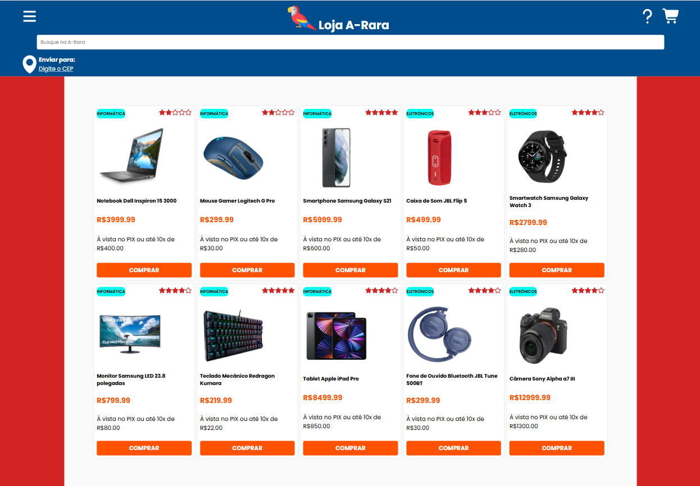

# 12-Lista-de-Produtos"
Projeto lista de produtos

Projeto desenvolvido como uma atividade prática durante as aulas de Programação Front End do Curso Desenvolvimento de Sistemas do Senai 

Tendo como proposta replicar o layout base de um e-commerce e carregar cards de protudos utilizando objetos JSON.

## Layout

## Tecnologias utilizadas:

* HTML
* CSS
* JavaScript

## Autor
[Edvan Alves](<https://br.linkedin.com/in/edvan-alves>)

Layout feito como prática, desenvolvido durante as aulas de Linguagem de Marcação do curso Desenvolvimento de Sistemas do Senai

O site foi desenvolvido utilizando boas práticas, com o uso de tags semânticas e responsividade